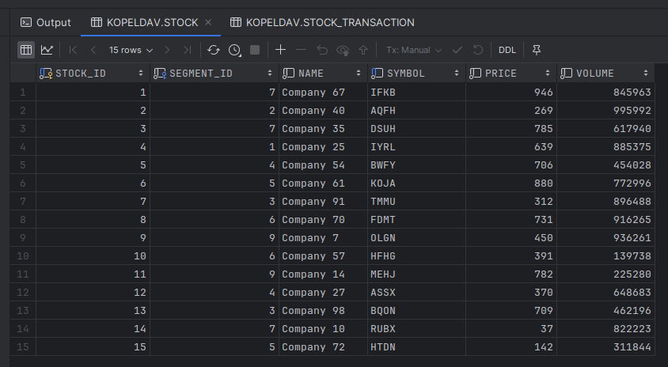

# Spouštění a výstup procedur
Screenshoty zachycují spuštění a výstupy procedur. 

## Spuštění procedur nad prázdnými tabulkami:
**Příkazy pro spuštění procedur:**

**Výstupem tohoto příkazu je:**

**Tabulky mají potom následující obsah:**
- INVESTOR

- STOCK

- STOCK_TRANSACTION

## Spuštění procedur nad neprázdnými tabulkami:
**Příkazy pro spuštění procedur:**

**Výstupem tohoto příkazu je:**

Obsah tabulek se v tomto případě nezměnil.

